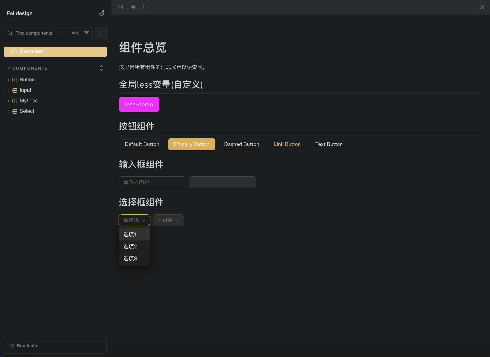
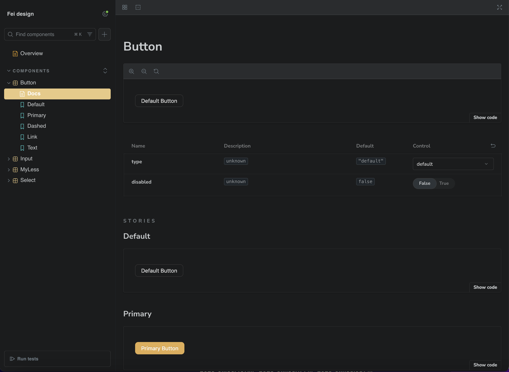
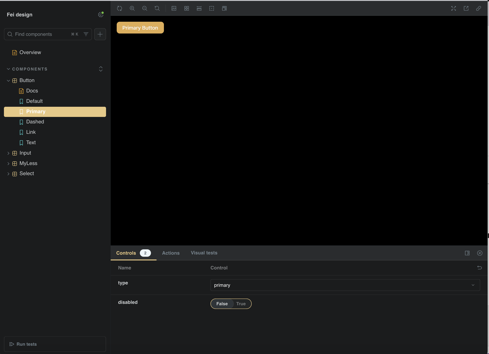
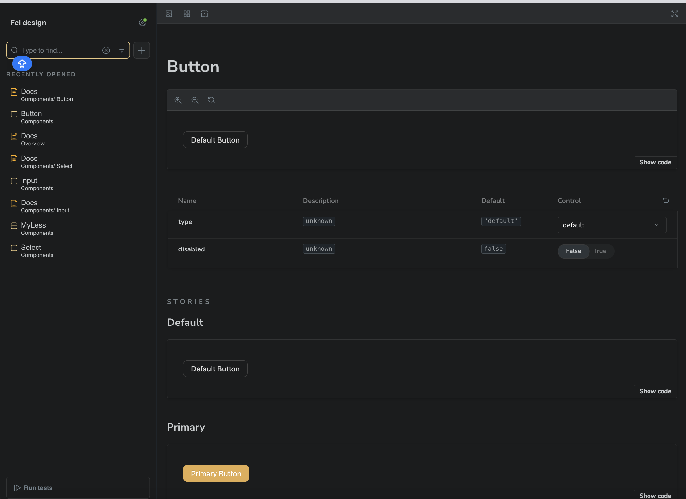

# React + Vite + Storybook + Theme + I18n

A biz component template based on antd(V4), which provides bookstory demo with Vite、 HMR and some ESLint rules.

Currently, two official plugins are available:

- [@vitejs/plugin-react](https://github.com/vitejs/vite-plugin-react/blob/main/packages/plugin-react/README.md) uses [Babel](https://babeljs.io/) for Fast Refresh
- [@vitejs/plugin-react-swc](https://github.com/vitejs/vite-plugin-react-swc) uses [SWC](https://swc.rs/) for Fast Refresh
- [storybook](https://storybook.js.org/docs)

## Expanding the ESLint configuration

If you are developing a production application, we recommend using TypeScript and enable type-aware lint rules. Check out the [TS template](https://github.com/vitejs/vite/tree/main/packages/create-vite/template-react-ts) to integrate TypeScript and [`typescript-eslint`](https://typescript-eslint.io) in your project.


## scripts
```
// run
rm -rf node_modules/.cache/storybook && npm run storybook

```

## docs for a new component
1. Auto generate documentation by storybook itself by add `tags: ['autodocs']` in the *.stories.jsx file
```
export default {
  title: 'Components/Button',
  component: Button,
  tags: ['autodocs'], 👉🏻👉🏻👉🏻 💡💡💡
  ...
};
```
2. Add the stories of the component into `Overview.mdx` which will automatically display in the overview page
```
// step1: import
import * as MyLessStories from './MyLess.stories';


// step2: usage
## 全局less变量(自定义)
<div style={{ display: 'flex', gap: '8px', flexWrap: 'wrap' }}>
    <Story of={MyLessStories.Default} name="Default MyLess" />
</div>
```


## initialization
```
npx create-vite my-project --template react
cd my-project
npm install

npx storybook@latest init
npm run storybook

npm install antd
npm install @emotion/react

npm start 👉🏻👉🏻👉🏻👉🏻👉🏻 clear cache and bootstrap
`or`
npm run storybook 👉🏻👉🏻👉🏻👉🏻👉🏻 bootstrap
```

💡 Why @emotion/react？
Storybook + Vite use @emotion/react to process CSS，which is also required by Ant Design for CSS compatibility


## screenshot




